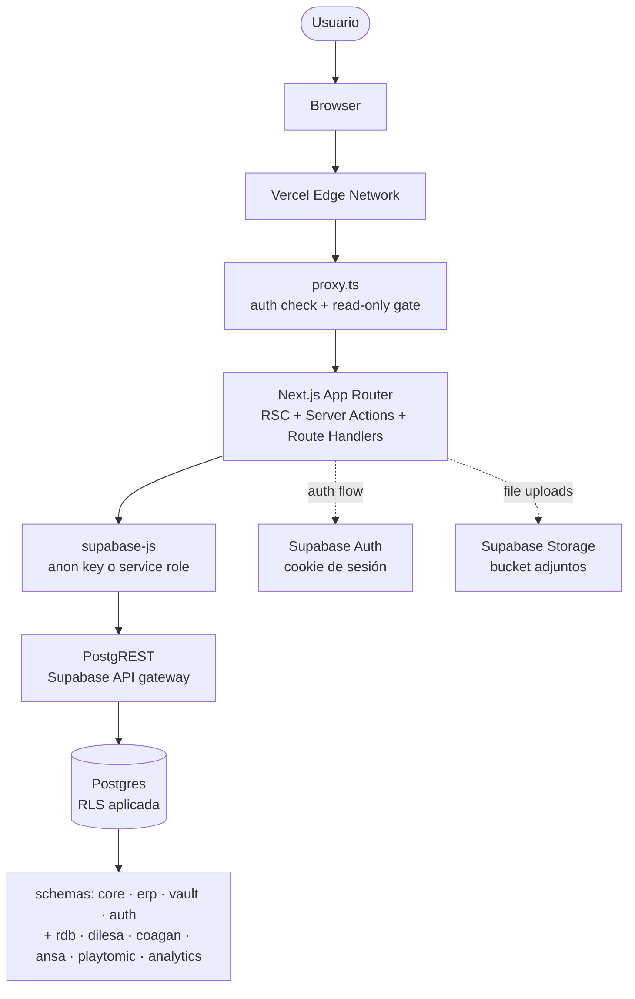
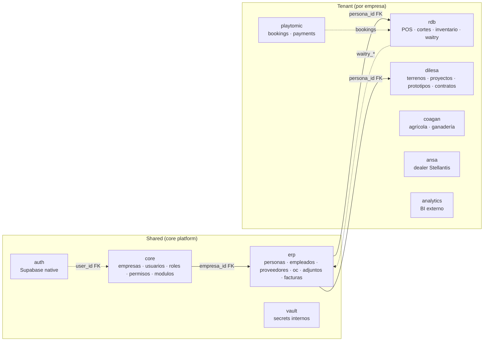
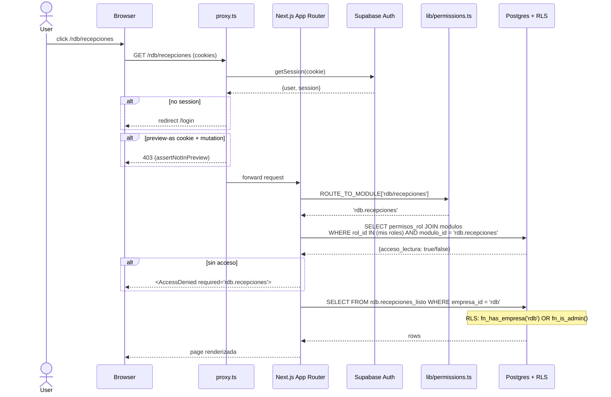

# BSOP OS — Arquitectura Master

> **Última revisión:** 2026-05-09
> **Status:** V1 — mapa-índice estable. Se mantiene vivo (ver "Cómo se mantiene este doc" al final).

---

## 0. TL;DR

**BSOP OS** es un ERP modular multi-tenant que opera el portafolio de empresas de Beto (RDB, DILESA, ANSA, COAGAN, Nigropetense). Reemplaza los frontends fragmentados de Coda con una sola Next.js app conectada a Supabase Postgres.

- **Frontend + backend:** Next.js 16 (App Router) + React + Tailwind v4 + shadcn/ui.
- **Database:** Supabase Postgres con schemas-per-tenant (`rdb`, `dilesa`, `coagan`, `ansa`, `playtomic`, `analytics`) + shared (`core`, `erp`, `vault`, `auth`).
- **Auth + RBAC:** Supabase Auth + permisos granulares por módulo y empresa (`core.modulos` × `core.permisos_rol`).
- **Hosting:** Vercel (deploy continuo desde `main` + previews por PR).
- **Multi-empresa:** un solo Next.js app, una página por empresa que delega en módulo compartido (ADR-011).

Una sesión nueva debería poder orientarse leyendo solo este doc + sus pointers a ADRs.

---

## 1. Mapa de capas — cómo viaja un request



**Notas clave:**

- `proxy.ts` (Vercel proxy / middleware) intercepta TODOS los requests antes del App Router. Valida sesión y bloquea mutations en preview-as ([ADR-027](../adr/027_viendo_como_readonly.md)).
- **Server Actions** son la vía canónica para mutations (no Route Handlers ad-hoc). Las Route Handlers se usan para webhooks externos, exports, integraciones.
- **RLS siempre activa.** El cliente jamás hace queries con service role; el server sí en operaciones legítimamente cross-empresa (ej. cron diarios, operaciones de admin).

---

## 2. Database layer — Supabase Postgres

### Schemas



### Schemas shared

- **`auth`** — Supabase native. Identity y credenciales. Casi nunca tocado directamente.
- **`core`** — Plataforma compartida: `empresas` (los 5 tenants), `usuarios`, `roles`, `permisos_rol`, `modulos` (catálogo de módulos por empresa con sección — [ADR-014](../adr/014_sidebar_taxonomia.md)), `usuarios_empresas` (membership), `empresa_documentos` (docs legales — [ADR-015](../adr/015_empresa_documentos_legales.md)), funciones helper (`fn_has_empresa`, `fn_is_admin`, `fn_persona_visible` — [ADR-029](../adr/029_personas_visibilidad_cross_empresa.md)).
- **`erp`** — Entidades de negocio compartidas entre empresas: `personas`, `empleados`, `empleados_puestos` (N:M — [ADR-013](../adr/013_empleados_multi_puesto_modelo.md)), `empleados_compensacion`, `empleados_pago`, `personas_datos_fiscales` (CSF — [supabase/adr/007](../../supabase/adr/007_personas_datos_fiscales.md)), satélites (`personas_contactos`, `personas_cuentas_bancarias`, `personas_direcciones` — [ADR-028](../adr/028_personas_satellites.md)), proveedores, OCs (`ordenes_compra`, líneas, recepciones, movimientos), adjuntos ([ADR-022](../adr/022_file_attachments.md)), facturas, juntas, tasks.
- **`vault`** — Secretos internos de la app (cuando son durables; los runtime usan Vercel env vars).

### Schemas tenant

Un schema por empresa que opera. Aísla data específica:

- **`rdb`** — POS Waitry (productos, ventas, cortes), inventario (stock, movimientos, levantamientos), Tiendita.
- **`dilesa`** — Inmobiliario: terrenos, prototipos, anteproyectos, proyectos, dossiers cliente.
- **`coagan`** — Operación agrícola/ganadera (todavía sin masa crítica de módulos UI).
- **`ansa`** — Dealer Stellantis (todavía sin masa crítica de módulos UI).
- **`playtomic`** — Bookings y payments de pádel (integración con Playtomic Manager).
- **`analytics`** — Vistas materializadas y ETL para BI externo (Metabase futuro).

### RLS canónica

Todas las tablas tenant usan RLS con la política:

```sql
-- Lectura
USING (
  core.fn_has_empresa(empresa_id)
  OR core.fn_persona_visible(persona_id)  -- solo en erp.personas, ADR-029
  OR core.fn_is_admin()
);

-- Escritura
WITH CHECK (
  core.fn_has_empresa(empresa_id)
  OR core.fn_is_admin()
);
```

`fn_has_empresa`, `fn_is_admin`, `fn_persona_visible` son `STABLE SECURITY DEFINER` y bypassean RLS al consultar `core.usuarios_empresas` y `core.usuarios.is_admin`.

### Workflow de migraciones

1. Escribir SQL en `supabase/migrations/<timestamp>_<slug>.sql`.
2. Aplicar con `supabase db push` (CC pide aprobación verbal a Beto antes — ver memoria `feedback_migraciones_db_bsop`).
3. Verificar con `\d schema.tabla` o `SELECT` directo (no encadenar con `&&`).
4. Regenerar `npm run schema:ref` → actualiza `supabase/SCHEMA_REF.md`.
5. Regenerar `npm run db:types` → actualiza `types/supabase.ts`.
6. **Toda migración debe terminar con `NOTIFY pgrst, 'reload schema';`** (memoria `feedback_pgrst_reload_post_migration`).
7. Commit con `SCHEMA_REF.md` y `types/supabase.ts` actualizados (CI lo enforce).

### Conexión cross-schema

Cuando una FK cruza schemas (ej. `rdb.waitry_productos.producto_id → erp.productos.id`), `supabase-js` con `.schema('rdb')` **no embebe** la fila de `erp` — hay que hacer dos queries con `.in()` (memoria `reference_supabase_cross_schema_fk`). Verificar `Relationships[]` en `types/supabase.ts` para saber qué embeds están disponibles.

### Nuevo schema = ALTER ROLE

Cualquier schema nuevo requiere:

```sql
ALTER ROLE authenticator SET pgrst.db_schemas = 'public, core, erp, rdb, dilesa, ...';
```

Sin esto, supabase-js devuelve HTTP 406 (memoria `reference_pgrst_db_schemas`).

---

## 3. Application layer — Next.js App Router

### Stack

- **Next.js 16** (App Router en root, **no `/src`**).
- **React 19** + **TypeScript 5.x**.
- **Tailwind CSS v4** + **shadcn/ui**.
- **react-hook-form** + **zod** (forms — [ADR-016](../adr/016_forms_pattern.md)).
- **@tanstack/react-table** (data tables — [ADR-010](../adr/010_data_table.md)).
- **vitest** (unit) + **playwright** (e2e + a11y).

### Convención de carpetas

```
/app
  /<empresa>/<modulo>/page.tsx     # thin wrapper que delega en <XModule>
  /administracion/...
  /api/...                          # route handlers (webhooks, exports, integraciones)
  /auth/...                         # login, callback
  /inicio/...                       # dashboard cross-empresa (widgets personales)
  /settings/...                     # admin: empresas, usuarios, acceso, roles
  layout.tsx
  page.tsx                          # landing
  globals.css
/components
  /<modulo>/                        # módulos compartidos (un módulo, N empresas)
  /<modulo>-module/                 # convención de naming alternativa
  /detail-page/                     # primitivos: <DetailPage>, <DetailDrawer> (ADR-009/018/026)
  /forms/                           # patrón forms: <Form>, <FormField>, etc. (ADR-016)
  /wizard/                          # patrón wizard multi-step (ADR-025)
  /module-page/                     # <EmptyState>, <TableSkeleton>, <ErrorBanner>, <DataTable> (ADR-006/010)
  /app-shell/                       # sidebar, header, NAV_ITEMS (ADR-014)
  /ui/                              # shadcn primitives (no tocar a mano fuera de cli)
/lib
  /supabase.ts                      # createClient (browser)
  /supabase-server.ts               # createClient (RSC + server actions)
  /supabase-admin.ts                # service role (server-only)
  /supabase-error.ts                # getSupabaseErrorMessage / toSupabaseError
  /permissions.ts                   # ROUTE_TO_MODULE + canAccessModulo
  /auth/effective-user.ts           # getEffectiveUser (preview-as aware)
  /storage/path.ts                  # buildAdjuntoPath (ADR-022)
  /<dominio>/...                    # helpers por dominio
/supabase
  /migrations/                      # SQL migrations en orden cronológico
  /adr/                             # ADRs DB-puros (001-008)
  SCHEMA_REF.md                     # autogenerado, NO editar a mano
/types
  supabase.ts                       # autogenerado, NO editar a mano
/docs
  /adr/                             # ADRs cross-cutting (005-029)
  /planning/                        # un doc por iniciativa
  /strategy/INITIATIVES.md          # índice activo
  /architecture/ARCHITECTURE.md     # ESTE DOC
  /qa/                              # docs auxiliares
  /testing/                         # guías de test
```

### Multi-empresa: una página por empresa, un módulo compartido

Patrón canónico ([ADR-011](../adr/011_shared_modules_cross_empresa.md)):

```tsx
// app/rdb/proveedores/page.tsx — thin wrapper
import { ProveedoresModule } from '@/components/proveedores/proveedores-module';
export default function Page() {
  return <ProveedoresModule empresaSlug="rdb" />;
}

// app/dilesa/proveedores/page.tsx — idéntica salvo el slug
export default function Page() {
  return <ProveedoresModule empresaSlug="dilesa" />;
}
```

El módulo compartido (`<ProveedoresModule>`) resuelve `empresa_id`, branding, permisos por módulo, y comportamiento por empresa internamente.

**Cuándo NO compartir:** features genuinamente específicas (ej. Cortes solo de RDB, Inmobiliario solo de DILESA). Ahí la página vive standalone bajo el segmento de la empresa.

### Tipos de archivos en `app/`

- **Server Components (default)** — todo lo bajo `app/` es RSC salvo que tenga `"use client"`.
- **Server Actions** — funciones server-only marcadas con `"use server"`. Vía canónica para mutations.
- **Route Handlers (`route.ts`)** — solo para webhooks externos (ej. Waitry, HAE), endpoints de export (CSV/PDF), integraciones que requieren Request/Response control fino.
- **Client Components (`"use client"`)** — donde haya state local, eventos, hooks de browser.

### Patrones de mutations

1. **Validar** con zod schema ([ADR-016 F1-F7](../adr/016_forms_pattern.md)).
2. **Auth gate**: `requireAdmin()` si es operación admin, o verificar membership con `core.usuarios_empresas` para operaciones por empresa.
3. **Preview-as gate**: `assertNotInPreview()` al inicio si la mutation NO debe correr en modo "viendo como" ([ADR-027 V1](../adr/027_viendo_como_readonly.md)).
4. **Operación**: insert/update/delete via supabase-js con RLS aplicada.
5. **Error handling**: `getSupabaseErrorMessage(error)` — `PostgrestError` no es `instanceof Error` (memoria `feedback_supabase_error_helper`).
6. **Audit log** opcional en `<entidad>_import_log` o tabla equivalente.
7. **Revalidate** la ruta o el path afectado.

---

## 4. Auth + RBAC — flujo end-to-end



### Componentes del flujo

- **`proxy.ts`** (Vercel middleware) — valida sesión, gate de preview-as.
- **`lib/permissions.ts`**:
  - `ROUTE_TO_MODULE`: mapa URL → slug del módulo.
  - `canAccessModulo(slug, permissions)`: retorna true/false según rol.
  - `EXPECTED_DB_MODULE_SLUGS`: lista canónica para test de drift contra DB.
- **`<RequireAccess module="...">`** ([ADR-024](../adr/024_access_denied_ux.md)) — gate UI declarativo.
- **`getEffectiveUser(supabase)`** ([ADR-027](../adr/027_viendo_como_readonly.md)) — devuelve user impersonado si `bsop_preview_as` cookie está set, real si no.
- **RLS canónica** — última línea de defensa. Aún si la app falla, RLS impide leakage.

### Liberación de módulo nuevo (RBAC sync)

**Tocar 4 lugares en el mismo PR**:

1. `components/app-shell/nav-config.ts` → `NAV_ITEMS` (sidebar).
2. `lib/permissions.ts` → `ROUTE_TO_MODULE`.
3. `lib/permissions.test.ts` → `EXPECTED_DB_MODULE_SLUGS`.
4. Migración SQL con `INSERT INTO core.modulos` + **backfill defensivo** en `core.permisos_rol` por cada rol existente × módulo nuevo. Sin backfill, el módulo queda **escondido** para no-admin (ver detalle en `CLAUDE.md` repo).

### Sub-slugs cuando el módulo tiene tabs ([ADR-030](../adr/030_submodule_permissions.md))

Cuando un módulo tiene **routed tabs** ([ADR-005](../adr/005_module_with_submodules_routed_tabs.md)), declarar 1 sub-slug por tab además del padre. Naming `<padre>.<sub>` (ej. `rdb.inventario.stock`). El padre actúa como **umbrella** (visibilidad en sidebar); los sub-slugs gobiernan **acceso real al contenido**.

- `<RoutedModuleTabs>` filtra automáticamente las tabs sin permiso (campo opcional `module: '<sub-slug>'` por tab).
- Cada sub-page tiene `<RequireAccess modulo="<sub-slug>">`. Si la page usa `useSearchParams` o `useUrlFilters`, separar el cuerpo a `<XBody/>` wrappeado por `<RequireAccess><XBody/></RequireAccess>` para evitar `missing-suspense-with-csr-bailout` en Next.js 16.
- Backfill defensivo al introducir sub-slugs a un módulo existente: clonar `(acceso_lectura, acceso_escritura)` del padre a cada hijo. Sin backfill, los usuarios actuales pierden las tabs.

Ver [reglas SS1-SS7 en ADR-030](../adr/030_submodule_permissions.md).

---

## 5. UI patterns — índice de ADRs

Índice navegable. Cada fila apunta al ADR autoritativo del tema.

### Layout y navegación

| Tema                                | ADR                                                                                     | Patrón canónico                                                         |
| ----------------------------------- | --------------------------------------------------------------------------------------- | ----------------------------------------------------------------------- |
| Sidebar y secciones                 | [ADR-014](../adr/014_sidebar_taxonomia.md)                                              | `NAV_ITEMS` agrupado por sección, filtrado por permisos                 |
| Sub-módulos como routed tabs        | [ADR-005](../adr/005_module_with_submodules_routed_tabs.md)                             | `app/<modulo>/{sub1,sub2}/page.tsx` con `layout.tsx` compartido         |
| Module page anatomy                 | [supabase/adr/004](../../supabase/adr/004_module_page_layout_convention.md)             | `<ModulePage>` slots o estructura libre con primitivos                  |
| Module states (empty/loading/error) | [ADR-006](../adr/006_module_states.md)                                                  | `<EmptyState>` / `<TableSkeleton>` / `<ErrorBanner>`                    |
| Filters URL-sync                    | [ADR-007](../adr/007_filters_url_sync.md)                                               | `useUrlFilters` + `<ActiveFiltersChip>`                                 |
| Detail page anatomy                 | [ADR-009](../adr/009_detail_page.md)                                                    | `<DetailPage>` + `<DetailHeader>` + `<DetailContent>` (D1-D5)           |
| Detail drawer                       | [ADR-018](../adr/018_drawer_anatomy.md), [ADR-026](../adr/026_drawer_anatomy_polish.md) | `<DetailDrawer size="sm/md/lg/xl">` (DD1-DD11)                          |
| Acciones completas en el detalle    | [ADR-044](../adr/044_detalle_con_set_completo_de_acciones.md)                           | footer del drawer/página con todas las acciones del documento (DA1-DA4) |
| Data tables                         | [ADR-010](../adr/010_data_table.md)                                                     | `<DataTable>` sobre @tanstack/react-table (DT1-DT8)                     |
| Module-level KPI strips             | [ADR-034](../adr/034_module_kpi_strips.md)                                              | `<ModuleKpiStrip>` deriva client-side del dataset (KPI1-KPI7)           |

### Forms y captura

| Tema               | ADR                                       | Patrón canónico                                      |
| ------------------ | ----------------------------------------- | ---------------------------------------------------- |
| Forms single-step  | [ADR-016](../adr/016_forms_pattern.md)    | `<Form>` + `useZodForm` + `<FormField>` (F1-F7)      |
| Wizards multi-step | [ADR-025](../adr/025_wizard_pattern.md)   | `<Wizard>` + `<WizardStep>` + `useWizard` (W1-W7)    |
| File attachments   | [ADR-022](../adr/022_file_attachments.md) | `<FileAttachments>` + `buildAdjuntoPath()` (FA1-FA6) |

### Feedback y estado

| Tema            | ADR                                           | Patrón canónico                                    |
| --------------- | --------------------------------------------- | -------------------------------------------------- |
| Action feedback | [ADR-008](../adr/008_action_feedback.md)      | `useActionFeedback` (toast/banner/confirm) (T1-T5) |
| Badge / status  | [ADR-017](../adr/017_badge_system.md)         | `<Badge tone>` con 6 tones canónicos (B1-B6)       |
| Activity log    | [ADR-023](../adr/023_activity_log_pattern.md) | `<ActivityLog>` con `ActivityEvent[]` (AL1-AL5)    |
| Print           | [ADR-021](../adr/021_print_pattern.md)        | `useTriggerPrint()` + Tailwind `print:` (P1-P5)    |

### Cross-cutting

| Tema                               | ADR                                                   | Patrón canónico                                                          |
| ---------------------------------- | ----------------------------------------------------- | ------------------------------------------------------------------------ |
| Módulos compartidos cross-empresa  | [ADR-011](../adr/011_shared_modules_cross_empresa.md) | thin page → `<XModule empresaSlug>` (SM1-SM6)                            |
| Responsive                         | [ADR-019](../adr/019_responsive_policy.md)            | JSDoc `@responsive` + `<DesktopOnlyNotice>` (R1-R5)                      |
| A11y baseline                      | [ADR-020](../adr/020_a11y_baseline.md)                | WCAG 2.1 AA + `@axe-core/playwright` (A1-A6)                             |
| Access denied                      | [ADR-024](../adr/024_access_denied_ux.md)             | `<AccessDenied>` + `<RequireAccess>` (AD1-AD5)                           |
| Read-only "viendo como"            | [ADR-027](../adr/027_viendo_como_readonly.md)         | cookie `bsop_preview_as` + `assertNotInPreview()` (V1-V5)                |
| Sub-module permissions (sub-slugs) | [ADR-030](../adr/030_submodule_permissions.md)        | sub-slugs `<padre>.<sub>` + `<RoutedModuleTabs module>` filter (SS1-SS7) |
| Workflow CC owns planning          | [ADR-012](../adr/012_workflow_cc_owns_planning.md)    | meta-decisión sobre roles                                                |
| Manual de usuario in-app           | [ADR-043](../adr/043_manual_usuario_in_app.md)        | markdown versionado + `<HelpButton>` contextual + PDF on-demand (M1-M8)  |
| Capa única de acceso a IA          | [ADR-046](../adr/046_capa_unica_acceso_ia.md)         | `lib/ai` único entry point + registry + drift-guard (registro-ia)        |

### Data / DB

| Tema                               | ADR                                                                                                                                                                                                                                    | Patrón canónico                                                            |
| ---------------------------------- | -------------------------------------------------------------------------------------------------------------------------------------------------------------------------------------------------------------------------------------- | -------------------------------------------------------------------------- |
| DILESA schema v1 (demolido)        | [supabase/adr/001](../../supabase/adr/001_dilesa_schema.md)                                                                                                                                                                            | pipeline lineal — reemplazado por v2                                       |
| DILESA portafolio — taxonomía      | [supabase/adr/009](../../supabase/adr/009_dilesa_portafolio_taxonomia.md)                                                                                                                                                              | Activo / Proyecto / Producto / Unidad                                      |
| DILESA portafolio — jerarquía      | [supabase/adr/010](../../supabase/adr/010_dilesa_portafolio_jerarquia.md)                                                                                                                                                              | padre/hijo + prorrateo de CapEx                                            |
| Health ingest soft-drop            | [supabase/adr/002](../../supabase/adr/002_health_ingest_soft_drop.md)                                                                                                                                                                  | dual-source AW+ST con preferencia                                          |
| Cortes totales fecha pushdown      | [supabase/adr/003](../../supabase/adr/003_v_cortes_totales_fecha_pushdown.md)                                                                                                                                                          | optimización de view                                                       |
| Empleados multi-puesto             | [ADR-013](../adr/013_empleados_multi_puesto_modelo.md)                                                                                                                                                                                 | `erp.empleados_puestos` N:M                                                |
| Empresa documentos legales         | [ADR-015](../adr/015_empresa_documentos_legales.md)                                                                                                                                                                                    | `core.empresa_documentos` (ED1-ED7)                                        |
| Personas datos fiscales (CSF)      | [supabase/adr/007](../../supabase/adr/007_personas_datos_fiscales.md)                                                                                                                                                                  | `personas_datos_fiscales`                                                  |
| Personas satellites                | [ADR-028](../adr/028_personas_satellites.md)                                                                                                                                                                                           | contactos / cuentas / direcciones                                          |
| Personas visibilidad cross-empresa | [ADR-029](../adr/029_personas_visibilidad_cross_empresa.md)                                                                                                                                                                            | `fn_persona_visible`                                                       |
| Waitry dedup root cause            | [supabase/adr/005](../../supabase/adr/005_rdb_waitry_dedup_root_cause.md), [supabase/adr/006](../../supabase/adr/006_rdb_waitry_forense_doble_tap.md), [supabase/adr/008](../../supabase/adr/008_rdb_waitry_cierre_terminal_change.md) | RDB Waitry detector + cierre                                               |
| Waitry dedup + paid (BSOP-side)    | [ADR-031](../adr/031_rdb_waitry_dedup_heuristic.md), [ADR-035](../adr/035_rdb_waitry_paid_false_no_venta.md), [ADR-036](../adr/036_rdb_waitry_fantasmas_tardios_propagacion.md)                                                        | fantasmas (tardíos) + `paid=false` ≠ venta (vistas + cortes + inventario)  |
| Subledger CxC / CxP (gemelo)       | [ADR-037](../adr/037_subledger_gemelo_cxc_cxp.md)                                                                                                                                                                                      | documento → pago → aplicación → saldo → aging                              |
| Contratos de obra (no-vivienda)    | [ADR-038](../adr/038_contratos_obra_modelo.md)                                                                                                                                                                                         | `tipo` + `obra_presupuesto` / `obra_estimaciones`                          |
| Puente obra → CxP                  | [ADR-039](../adr/039_puente_obra_cxp.md)                                                                                                                                                                                               | estimación → factura de egreso (neto)                                      |
| Conceptos de compra + presupuesto  | [ADR-040](../adr/040_conceptos_compra_y_presupuesto_unificado.md)                                                                                                                                                                      | catálogo jerárquico en `erp` + `tipo_insumo` atributo                      |
| Ejercido gasto directo (sin OC)    | [ADR-041](../adr/041_ejercido_gasto_directo_factura_sin_oc.md)                                                                                                                                                                         | `v_partida_control.ejercido` = recibido OC + facturas con partida sin OC   |
| Contrato de obra → partida (1:1)   | [ADR-042](../adr/042_contrato_obra_al_control_de_partidas.md)                                                                                                                                                                          | contrato compromete 1 partida; estimación hereda partida → ejercido/pagado |

> **Nota sobre numeración:** ADRs 001-004 viven en `supabase/adr/` (DB-puros originales). ADRs 005-029 viven en `docs/adr/` (decisiones cross-cutting de stack/UI/RBAC). `supabase/adr/` también renumeró 005-008 internamente para waitry/personas — el contexto del directorio resuelve la ambigüedad. Cleanup pendiente como follow-up no urgente (ver `docs/planning/architecture-master.md`).

---

## 6. Reglas duras (no negociables)

### Antes de tocar SQL

- Leer `supabase/SCHEMA_REF.md` para nombres exactos de tablas/columnas. Las fechas vienen en UTC — parsear con timezone.
- Beto corre SQL diagnóstico en el SQL Editor web de Supabase (no `psql`); evitar `DO $$ ... RAISE NOTICE`, preferir `SELECT` o `pg_temp.fn() RETURNS TABLE` (memoria `feedback_supabase_sql_editor`).

### Antes de `git push`

Correr **5 checks sobre TODO el repo** (no solo archivos tocados):

```bash
npm run typecheck       # tsc --noEmit
npm run test:run        # vitest run
npm run lint            # eslint .
npm run format:check    # prettier --check .
npm run schema:check    # drift entre DB live y SCHEMA_REF.md (si SUPABASE_DB_URL set)
```

Si `format:check` reporta archivos que no toqué, los formateo en el mismo PR.

### Después de `git push`

Vigilar CI hasta verde:

```bash
gh pr checks <PR-number> --watch --interval 15
```

No reportar el PR como entregado hasta que esté verde.

### Mocks de DB en tests

**Prohibidos.** Tests integran contra Supabase real (Preview o local). Razón: mocked tests pasan pero migrations en prod fallan (memoria `feedback_verificacion_local_bsop`).

### Anti-patrones detectados (evitar)

- `<Sheet>` raw fuera de `components/ui/sheet.tsx` y `components/detail-page/detail-drawer.tsx` — usar `<DetailDrawer>` ([ADR-018](../adr/018_drawer_anatomy.md)).
- `window.print()` directo — usar `useTriggerPrint()` ([ADR-021](../adr/021_print_pattern.md)).
- `useState` per-field en forms — usar `<Form>` + RHF ([ADR-016](../adr/016_forms_pattern.md)).
- Editar `SCHEMA_REF.md` o `types/supabase.ts` a mano — son autogenerados.
- Insertar módulo nuevo sin backfill defensivo de `core.permisos_rol` — esconde el módulo a no-admin.
- Encadenar `db push && psql && ...` con `&&` — verificar exit code antes de continuar (memoria `feedback_apply_migration_order`).
- `redirect_uri` distinto entre OAuth callbacks y `auth.callback` — preview tiene wildcards específicos en Supabase.

---

## 7. Memoria operativa del repo

Dónde vive cada cosa:

| Recurso                 | Path                                          | Rol                                                    |
| ----------------------- | --------------------------------------------- | ------------------------------------------------------ |
| Iniciativas activas     | `docs/strategy/INITIATIVES.md`                | Índice + tabla `## Activas` y `## Done`                |
| Detalle de iniciativa   | `docs/planning/<slug>.md`                     | Problema + Outcome + Alcance + Bitácora + Decisiones   |
| ADRs cross-cutting      | `docs/adr/NNNN_<titulo>.md`                   | Decisiones que cruzan iniciativas                      |
| ADRs DB-puros           | `supabase/adr/NNNN_<titulo>.md`               | Decisiones SQL/schema                                  |
| Schema reference        | `supabase/SCHEMA_REF.md`                      | Autogenerado por `npm run schema:ref`                  |
| Tipos TypeScript        | `types/supabase.ts`                           | Autogenerado por `npm run db:types`                    |
| Migrations SQL          | `supabase/migrations/<ts>_<slug>.sql`         | Orden cronológico                                      |
| Protocolo de sesión     | `CLAUDE.md` (repo)                            | Cómo CC opera en el repo                               |
| Reglas globales de Beto | `~/.claude/CLAUDE.md`                         | Identidad + colaboración + reglas duras cross-proyecto |
| Memorias auto           | `~/.claude/projects/-Users-Beto-BSOP/memory/` | Patrones aprendidos persistentes                       |

### Glosario (3 términos clave)

- **Iniciativa** — trabajo grande con doc en `docs/planning/<slug>.md` y fila en `INITIATIVES.md`. Beto autoriza promoción.
- **Sprint** — subdivisión ejecutiva dentro de una iniciativa. Vive en TodoWrite, muere con la sesión.
- **ADR** — Architecture Decision Record. Decisión que cruza iniciativas o tiene tradeoffs no obvios.

---

## 8. Topics open / no decididos todavía

Decisiones que no han sido tomadas o que son aspiracionales. No documentar prematuramente — cada una se vuelve ADR cuando se decide.

- **Vercel Services (multi-service deploy)** — ¿cuándo separamos backend Python/Go del Next.js? Hoy todo vive en un solo deploy.
- **Edge vs Node runtime por route handler** — política aún ad-hoc; default Node, Edge solo donde se justifique.
- **Workflow DevKit (Vercel Workflows)** — para crons largos, orquestación multi-paso con retries. No usado aún; los crons hoy son simples Vercel Cron Jobs.
- **Backups externos** — iniciativa `db-backup-strategy` en `proposed`. Hoy solo daily backup automático de Supabase Pro (7 días retención).
- **BI externo (Metabase)** — iniciativa `analytics` en `blocked` esperando bootstrap del Cowork.
- **Ramp-up de schemas tenant** — `coagan` y `ansa` aún sin masa crítica de módulos UI; entran cuando esas empresas operen activamente.
- **Realtime cross-tab/cross-page** — Supabase Realtime + Broadcast Channel. Ad-hoc por ahora; documentado como follow-up en varios planning docs.
- **Conflicto de numeración ADR** — ADR-005-008 existen tanto en `docs/adr/` como en `supabase/adr/`. Cleanup pendiente (ver `docs/planning/architecture-master.md`).

---

## 9. Cómo se mantiene este doc

Regla blanda (no proceso pesado):

- **Al crear un ADR nuevo** → agregar 1 línea al índice de §5 en la sección que corresponda.
- **Al cambiar el stack** (versión mayor de Next/React/Supabase, runtime nuevo, capa nueva) → update §3 (Stack) y §1 (Mapa de capas).
- **Al promover una iniciativa que vuelve "topic open"** → quitarla de §8.
- **Al introducir un schema nuevo** → agregar a §2 (DB layer) y al diagrama mermaid de schemas.
- **Al detectar un anti-patrón nuevo** → agregar a §6.

Si en 2-3 meses el doc se desincroniza, formalizamos un ADR-030 "Architecture-as-Index" con proceso explícito. Hasta entonces, la regla blanda + pointers son suficientes.

**Última revisión:** 2026-05-09 — V1 inicial.
